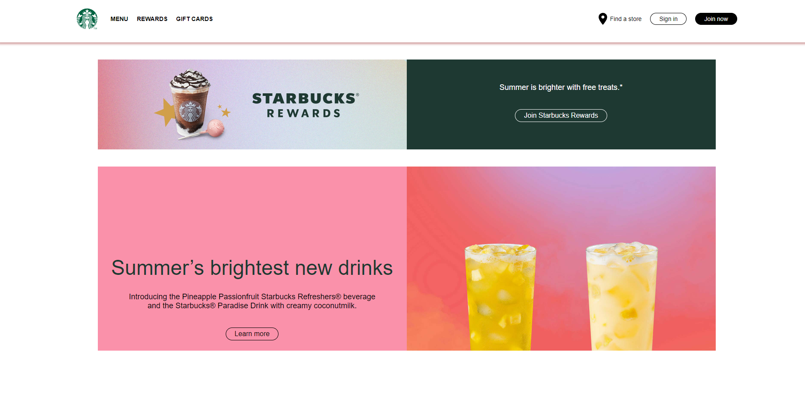

# Project Name

Starbucks

## Table of Contents

- [General Info](#general-information)
- [Technologies Used](#technologies-used)
- [Features](#features)
- [Screenshots](#screenshots)
- [Setup](#setup)
- [Usage](#usage)
- [Project Status](#project-status)
- [Room for Improvement](#room-for-improvement)
- [Acknowledgements](#acknowledgements)
- [Contact](#contact)
<!-- * [License](#license) -->

## General Information

Odwzorowanie tylko i wylacznie graficznej strony internetowej starbucksa

## Technologies Used

- Tech 1 - html
- Tech 2 - css

## Features

odwzorowanie stronki bez mozliwosci klikania i ogladania zakladek

## Screenshots

<!-- If you have screenshots you'd like to share, include them here. -->

## Setup

nic nie instalujemy, otwieramy tylko index

## Usage

Aplikacja stworzona w html'u style nadano w css

## Project Status

In progress, zostanie dodany backend

## Room for Improvement

dadanie backendu

## Acknowledgements

--yt/https://www.youtube.com/watch?v=opNgrPv3Qw8

## Contact

Created by Mikolaj Barczynski

<!-- Optional -->
<!-- ## License -->
<!-- This project is open source and available under the [... License](). -->

<!-- You don't have to include all sections - just the one's relevant to your project -->
